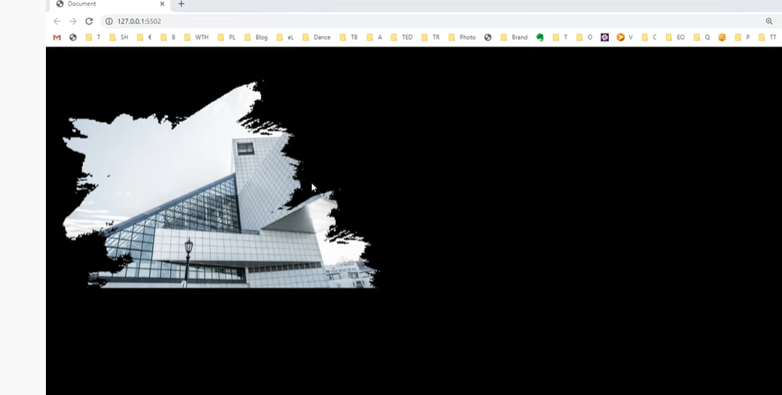
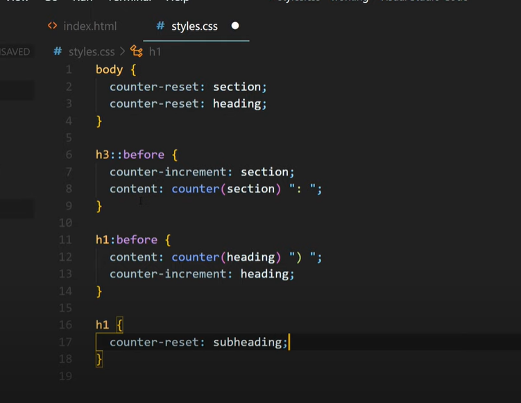

# Getting Started

## Quick Start
```
npm install -s mdb-cli 
```


## [6 CSS Tricks you didnt know](https://www.youtube.com/watch?v=iFhVG2LQ2xU)
* masks changes the shape  of an image
```css
img{
  image-mask: url(mask.png);
  -webkit-image-mask: url(mask.png);
}
```

* also done with linear-gradient
```css
mask-image: linear-gradient(to bottom,transparent 25%,black 75%);
```

### Counter Reset



### 
::first-letter, selector takes first letter of a word

::selection changes the highlight color of selection by cursor